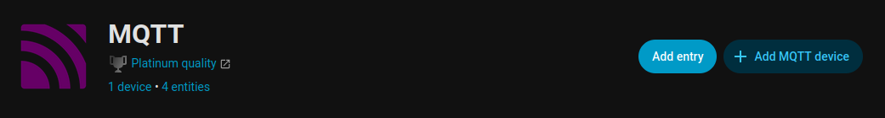
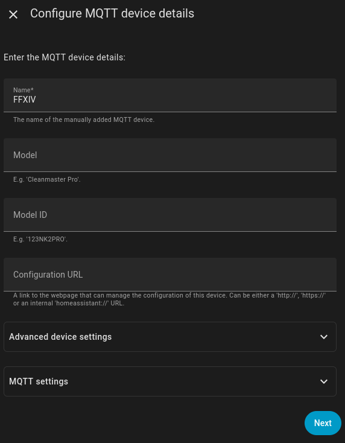
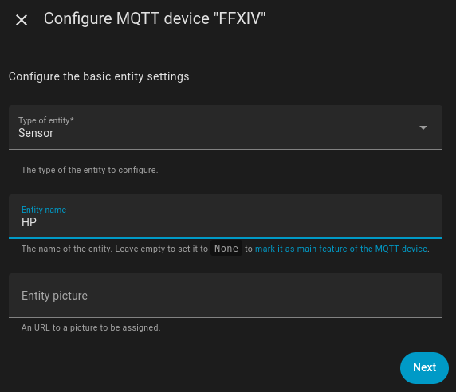
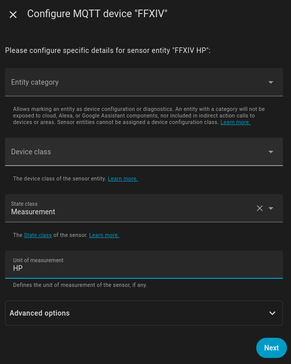
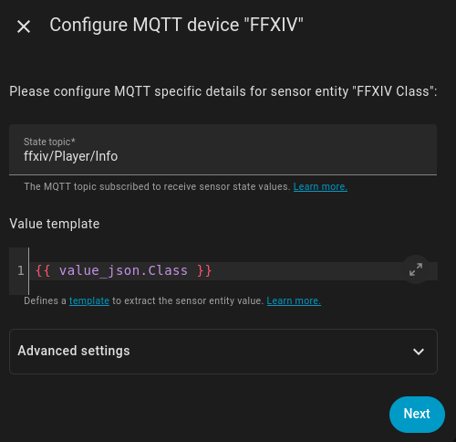
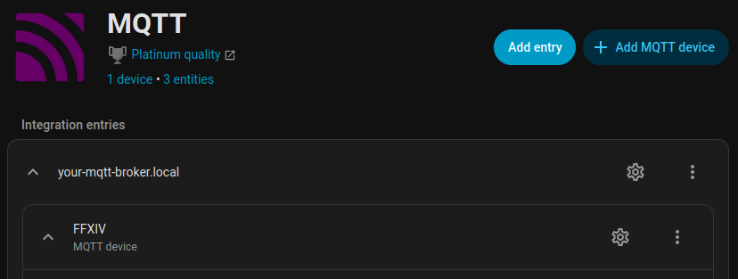
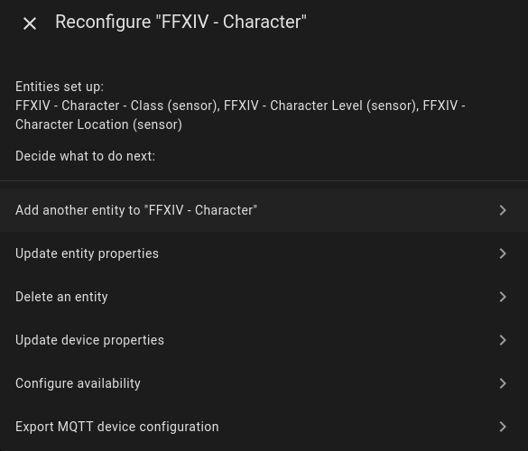

# FFXIV2MQTT

Outputs data to an MQTT broker for home automation.
Requires a broker that supports MQTT V5.

## Setup

Use /mqtt to open the menu.
Defaults are fine for most cases. If you have multiple computers running the plugin, use a unique ClientID on both, and
check "Include Client ID in Topic". This will change the topic structure from `ffxiv/#` to `ffxiv/ClientID/#`, allowing
you to easily differentiate them.

## Available Topics

Below is a list of Topics that this plugin can send:

- **Event Topics**
  - Event/ContentFinder
  - Event/Login
  - Event/TerritoryChanged
  - Event/WorldChanged

- **Party and Player Information**
  - Party
  - Player/Casting
  - Player/Combat/Stats
  - Player/Conditions
  - Player/Crafter/CurrentStats
  - Player/Gatherer/CurrentStats
  - Player/Info
  - Player/Status

- **Job-Specific Player Gauges**
  - Player/JobGauge/AST
  - Player/JobGauge/BRD
  - Player/JobGauge/BLM
  - Player/JobGauge/DNC
  - Player/JobGauge/DRK
  - Player/JobGauge/DRG
  - Player/JobGauge/GNB
  - Player/JobGauge/MCH
  - Player/JobGauge/MNK
  - Player/JobGauge/NIN
  - Player/JobGauge/PLD
  - Player/JobGauge/PCT
  - Player/JobGauge/RPR
  - Player/JobGauge/RDM
  - Player/JobGauge/SGE
  - Player/JobGauge/SAM
  - Player/JobGauge/SCH
  - Player/JobGauge/SMN
  - Player/JobGauge/VPR
  - Player/JobGauge/WAR
  - Player/JobGauge/WHM

You can also send a custom message with  `/mqttcustom <topic> <payload>`.

For more detailed information about these Topics, refer to the source code: [ffxiv2Mqtt/Topics](/ffxiv2Mqtt/Topics).

## Using with Home Assistant

If you are using Mosquitto Broker through [Home Assistant](home-assistant.io), you can just add new a Home Assistant user and input the
password and user into the plugin config.

### Directly using MQTT Messages in Automations

Automations can be set up easily with the GUI or YAML without creating entities first. Here's an example:

```yaml
- id: '1233546621323'
  alias: FFXIV Queue Pop Notification
  description: ''
  trigger:
  - platform: mqtt
    topic: ffxiv/Event/ContentFinder
    payload: Pop
  action:
  - service: notify.homeassistant_app
    data:
      message: Pop
```

### Using Custom Messages in Automations

You can send custom messages in-game to your MQTT broker, which can allow you to manually trigger Home Assistant automations using in-game commands. An example of using this would be to put `/mqttcustom lights on` in a macro, then create an automation in Home Assistant to respond to this message to turn your lights on:

```yaml
- id: '1654026881455'
  alias: FFXIV Turn Lights Up
  description: ''
  trigger:
  - platform: mqtt
    topic: ffxiv/lights
    payload: on
  condition: []
  action:
  - service: light.turn_on
    data: {}
    target:
      area_id:
      - bedroom
```

You now have a macro in game that can turn on your bedroom lights!

### Creating Entities

You can also create entities within Home Assistant, and use those entities in automations. Creating entities will also maintain a history of the tracked states.

To create a sensor, first identify the data you want to track. For instance, if we want to create an entity of our character's current class, we'll need to subscribe to the `ffxiv/Player/Info` topic (make sure to add your client ID if you set one). You may want to go into the MQTT device settings and subscribe to `ffxiv/#` (or `ffxiv/clientID/#` if you set a client ID in the plugin settings)) to see all available data and properties.

To add your first entity, click the "Add MQTT device" button:

.

Next, give your entry a name, such as "FFXIV" (or "FFXIV character_name" if you have multiple characters and have set up different character IDs in your plugin configuration):



Next, configure the entity settings. For most FFXIV data sources, you'll want to select "sensor" as the entity type. Also give your entity a suitable name if you would like.



On the next menu, if you are tracking something that is a number, you will need to change the state class to "measurement" and give the entity a unit of measurement (you can type anything you want, the dropdowns are just suggestions). Otherwise, you can ignore this screen and click "Next":




On the next menu, first put the topic you need to subscribe to in the State topic input. Next, you'll need to select the property you want in the value template. For example, if we want the Class property, we'll need to put `{{ value_json.Class }}` as the value template. If this entity is a number, convert the value to an integer in the template by wrapping it in `int()` or `float()` as such: `{{ int(value_json.HP) }}`:



**Make sure to select "Save Changes" after adding a new sensor!**

---
After adding the first sensor, you can add additional sensors under the existing entry by clicking the gear next to the main MQTT entry you set up in the previous step, then selecting the "Add another entity" option:



